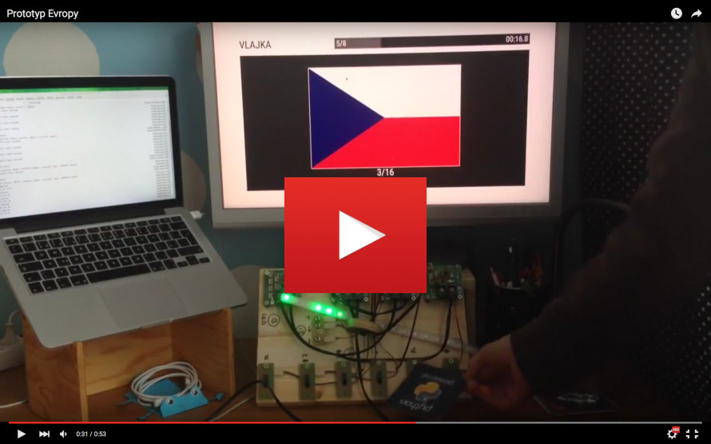

Europe is interactive knowledge game for children.

**Content**:

* [Construction](#construction)
    * [Gameboard](#gameboard)
    * [Hardware](#hardware)
    * [Software](#software)
    * [Design](#design)
    * [Content](#content)
* [Docker](#docker)
    * [Build](#build)
    * [Run](#run)
* [Application](#application)
    * [Game interface](#game-interface)
    * [Run](#run)
* [Notes](#notes)
    * [Database initialization](#database-initialization)
    * [Coffeescript compilation](#coffeescript-compilation)
    * [LESS compilation](#less-compilation)
    * [Debug mode for Javascript application](#debug-mode-for-javascript-application)

# Construction

It is constructed from several parts:

* big wooden gameboard with map of Europe
* bunch of electronics
* software

## Gameboard

Board will be connected to the ground via spring, so children will be able to 
tilt it. Each european country will have gate on his territory. 

## Hardware

Each gate is constructed as optical sensor. On bottom part of board is 10
control boards, each of them capable to read state up to 6 sensors. Boards are
interconnected via ModBus.

There are additional 2 special boards -- one of them will serve as keyboard
(instead of optical sensors it will read state from buttons), second as 
controller of Neopixels RGB LED.

Details about hardware solution is stored in [`hardware/`](hardware) directory.

## Software

ModBus is connected through USB adapter to Intel NUC miniPC with Ubuntu Linux
and all necessary software:

* Django API backend
* Django Admin backend
* Python Watcher script, which read status from HW boards and send events
  through websocket connection to browser
* Frontend Javascript application build in Marionette framework

All components are dockerized and run behind Nginx proxy.

There are several subdirectories in regards to software part of this project:

* [`ansible/`](ansible)  
  Playbooks for bootstraping Ubuntu system (it will turn plain Ubuntu into 
  Evropa dedicated machine)
* [`europe/`](europe)  
  Django backend application, which realise API interface and administration
  for editing content (game questions)
* [`static/`](static)  
  Frontend Javascript application
* [`watcher/`](watecher)  
  Python3 application communicating with hardware (ModBus via USB) and implementing
  websockets server. Frontend Javascript application communicate with HW in
  real-time via messages sent over websocket.

## Design

Application design evolve in time. You could found some of the designs in 
[`screenshots/`](screenshots) directory. In [`layouts/`](layouts) is stored 
rough HTML version of early version application for easier CSS development.

## Content

Content of the game (questions about european countries) will be edited via
web administration. For easier development there are some of the content
store in directory [`content/`](content).

# Docker

There are several Dockerfiles in root directory, suffix indicate purpose of
file. Because there are lot of them, and running them manually from commandline
could be complicated, we use Docker Compose.

Main description is stored in [`docker-compose.yml`](docker-compose.yml).
According to [Docker Compose documentation](https://docs.docker.com/compose/extends/), 
there is standard way how to extend basic yml and adapt it to different
environments (notebook, Intel NUC, demo on Digital Ocean). This variants are
stored as `docker-compose.<ENV>.yml` files. To apply it, choose one, copy it or
make a named symlink `docker-compose.override.yml` (I personally use `devel`
variant on my notebook).

## Build

Run this commands:

    docker build -f Dockerfile.base -t msgre/common:europe-base.latest .
    docker-compose build
    cd watcher/ && docker build -t msgre/common:europe-watcher.latest .

`base` is general Django container, `watcher` take care about HW monitoring
and publish events on websockets.

## Run

    docker-compose up -d
    docker-compose logs

To kill and remove running containers, run:

    docker-compose kill && docker-compose rm -f

Beware! If you run Europe for first time, you must initiate database. See
[Database initialization](#database-initialization) below.

# Application

## Game interface

Open in **Chrome** browser URL http://192.168.99.100:8081/
(warning, doesn't work properly in Firefox due to disfunctional keyboard plugin).

For controling web app use following keys (they will be replaced in final 
product to real physical keys):

* `Q` = left
* `W` = right
* `P` = choice

During game phase, use:

* `0` = wrong answer
* `1` = right answer

If you run `watcher` container in debug mode, you could simulate HW events by
touching files in `watcher/gates` directory. For example:

    touch watcher/gates/14/1

will simulate ball passing gate number 1 on board 14. Same way you could 
simulate keyboard events.

## Game administration

There is standard Django admin interface on http://192.168.99.100:8081/admin.
You could modify options, questions, and several other details about game.

# Notes

## Database initialization

Connect to already running `admin` container:

    docker exec -ti admin bash

Run following commands:

    ./manage.py migrate
    ./manage.py createsuperuser
    ./manage.py initial_questions /content
    ./manage.py fake_results

After this sequence, your DB schema will be up to date, and will contain
data about superadmin (to access administration via web interface), fake
results data (to bypass results pages with no entries) and initial set of
questions loaded from `content/` directory.

## Coffeescript compilation

First, check that you have CoffeeScript container. If no, build it:

    docker build -f Dockerfile.coffee -t msgre/common:coffee.latest .

One-time Coffeescript to Javascript compilation:

    docker run -ti --rm -v $PWD/static/app:/src msgre/common:coffee.latest -bc /src

Continuous compilation based on changes in watched directory:

    fswatch --exclude="\.js$" -o $PWD/static/app | xargs -n1 -I{} docker run -i --rm -v $PWD/static/app:/src msgre/common:coffee.latest -bc /src

## LESS compilation

One-time compilation:

    docker run -i --rm -v $PWD/static/css:/src ewoutp/lessc:latest /src/styles.less > $PWD/static/css/styles.css

## Debug mode for Javascript application

For debugging purposes you could add special URL parameters to directly enter
one of the Javascript application screens. In this case timeouts (part of code
that return you to initial `intro` page) will be set to very high value, so
you stay on given page for very long time (and you could debug HTML/CSS/JS 
things with peace in mind).

Enter URLs like `http://192.168.99.100:8081/?intro`. Last part after `?` 
character tells in which page you are interested. Enter one of this values:
`intro`, `crossroad`, `scores`, `gamemode`, `countdown`, `game`, `result`, 
`recap`, `score`.
